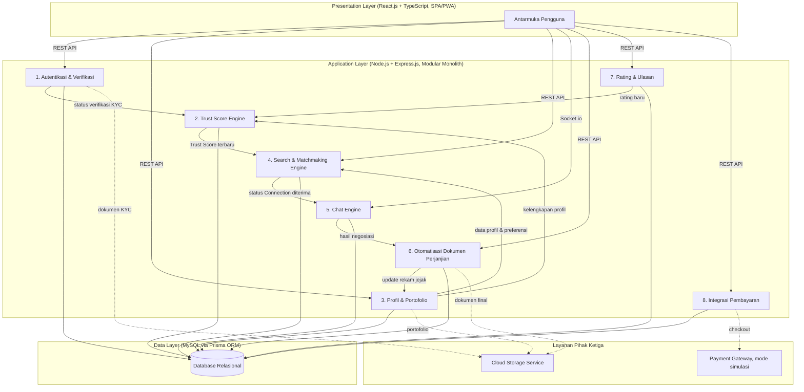
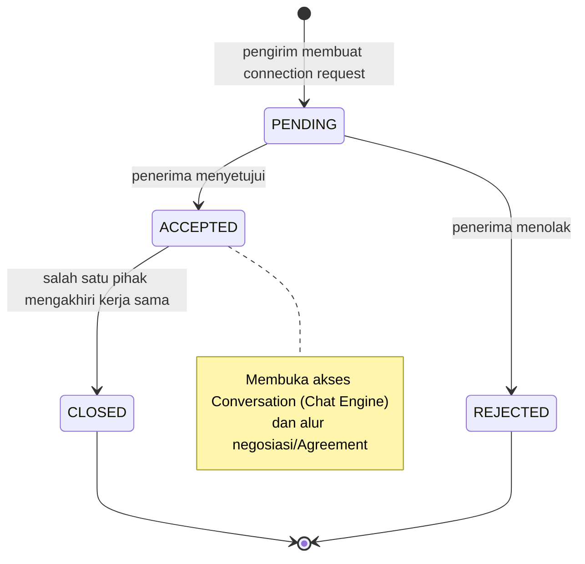

Dokumen ini adalah acuan teknis untuk membangun software Modalin, diturunkan langsung dari proposal HOLOGY 9.0 HoloDev (tim El Yapping) supaya kode yang ditulis selalu konsisten dengan apa yang diklaim di proposal. Kriteria Kelayakan dan Implementasi (15% Babak Penyisihan) menilai persis kesesuaian ini, jadi kalau ada keputusan baru saat coding yang menyimpang dari sini, update dokumen ini dan proposal secara bersamaan, jangan biarkan menyimpang diam-diam.

Dokumen terkait, jangan duplikasi manual, cukup rujuk:
- `CLAUDE.md`: ringkasan cepat untuk konteks Claude Code saat sesi coding, versi singkat dari dokumen ini.
- `modalin-erd.dbml`: satu-satunya sumber kebenaran untuk skema database persis (tipe kolom, constraint, relasi). Generate ulang gambar ERD lewat dbdiagram.io tiap kali file ini berubah.
- Proposal HOLOGY 9.0: dokumen yang dinilai juri. Kalau ada perbedaan antara dokumen ini dan proposal, proposal yang mengikat untuk keperluan submission, tapi segera samakan dua-duanya.

## 1. Ringkasan Produk

Modalin adalah platform web yang mempertemukan UMKM pencari modal dengan investor secara langsung. Masalah yang diselesaikan: proses pinjaman konvensional yang berbelit dan gap pembiayaan UMKM di satu sisi, kesulitan investor menemukan mitra kredibel dan transparan di sisi lain. Solusinya: sistem pencocokan otomatis berbasis skor kepercayaan, pencarian manual dengan filter, chat langsung, otomatisasi dokumen perjanjian, dan rating pasca kerja sama, semuanya dalam satu ekosistem.

Dua peran pengguna utama (Pengusaha/UMKM dan Investor) ditambah satu peran internal (Admin, untuk verifikasi dokumen KYC). Admin bukan tabel terpisah, hanya nilai `role` pada tabel `User` yang sama.

## 2. Aktor dan Kebutuhan Pengguna

### 2.1 Pengusaha (UMKM)

Mayoritas diasumsikan mengakses lewat smartphone, literasi digital dan keuangan bervariasi. Implikasi desain: alur pengisian profil harus bertahap dan bisa dilanjutkan meski koneksi tidak stabil, istilah skema kerja sama (Bagi Hasil, Penyertaan Modal, Pinjaman) perlu penjelasan berbasis ikon dan bahasa awam, rekomendasi mitra harus otomatis muncul tanpa pencarian manual berulang, status tiap tahap (menunggu respons, negosiasi, aktif, selesai) harus selalu jelas, dan tanda tangan dokumen harus bisa dilakukan langsung dari layar sentuh tanpa aplikasi tambahan.

### 2.2 Investor

Kebutuhan utamanya menyaring UMKM kredibel secara cepat dari banyak profil. Implikasi desain: indikator kredibilitas (Trust Score, badge Terverifikasi) harus terbaca sekilas tanpa buka profil detail, filter harus fleksibel dan bisa dikombinasikan, rekam jejak dan rating UMKM sebelumnya harus tampil sebagai bahan due diligence, dan tampilan harus nyaman baik di desktop (analisis dan pengisian dokumen) maupun mobile (pemantauan saat bepergian).

### 2.3 Admin (internal)

Fokusnya efisiensi memproses volume verifikasi dokumen. Implikasi desain: antrean dokumen KYC (KTP, NIB) terurut berdasarkan waktu unggah, mekanisme approve/reject satu klik dengan catatan alasan singkat saat reject, dan riwayat keputusan verifikasi tersimpan untuk audit.

## 3. Tech Stack

| Lapisan | Teknologi | Catatan |
|---|---|---|
| Presentation | React.js + TypeScript, Single Page Application | Dibangun sebagai PWA: service worker, installable (Add to Home Screen), terasa native |
| Application | Node.js + Express.js | Pola Modular Monolith, 8 modul domain independen (lihat bagian 4) |
| Data | MySQL | Diakses lewat Prisma ORM, bukan Sequelize |
| Realtime | Socket.io | Khusus fitur chat (Modul 5), dua arah |
| Auth | JWT stateless + refresh token | Password di-hash pakai Argon2id (bukan bcrypt, sesuai standar OWASP terkini) |
| Payment | Midtrans/Xendit, mode simulasi | Babak penyisihan: UI simulasi saja (tombol + status sukses palsu), tanpa SDK asli. Sandbox asli diproyeksikan babak final |
| File storage | Cloud Storage Service | Untuk KTP, NIB, dokumen portofolio, dokumen perjanjian yang sudah ditandatangani |
| Locale | Bahasa Indonesia saja | Format mata uang Rupiah, format tanggal Indonesia, tidak ada dukungan multibahasa untuk MVP |

## 4. Arsitektur Sistem

Three-Layer Architecture (Presentation, Application, Data) dikombinasikan dengan Modular Monolith pada Application Layer. Alasan pemilihan: struktur kode terorganisasi per modul domain tanpa kompleksitas operasional microservices yang tidak sesuai skala tim (3 orang), dan selaras dengan siklus sprint Agile Scrum karena tiap modul bisa dikembangkan dan diuji terpisah.

### 4.1 Delapan Modul Domain (Application Layer)

| Modul | Tanggung Jawab | Bergantung Pada | FR Terkait |
|---|---|---|---|
| 1. Autentikasi & Verifikasi | Registrasi, login, refresh token, validasi KYC (KTP kedua peran, NIB khusus Pengusaha), middleware otorisasi JWT terpusat untuk semua modul lain | - | FR-01, FR-02 |
| 2. Trust Score Engine | Hitung ulang Trust Score (0-100) tiap ada perubahan input, target di bawah 5 detik | Dipicu Modul 1 (verifikasi), Modul 3 (kelengkapan profil), Modul 7 (rating baru) | FR-03 |
| 3. Profil & Portofolio | Data deskriptif bisnis/investor (sektor, dana, lokasi, jenis kerja sama), referensi file portofolio dan dokumen pendukung | - | FR-04 |
| 4. Search & Matchmaking Engine | Filter manual dan pencocokan otomatis dua tahap (hard filter lalu weighted scoring), mengelola siklus status Connection | Baca dari Modul 2 dan Modul 3 | FR-05, FR-06, FR-07, FR-14 |
| 5. Chat Engine | Pesan real-time dua arah lewat Socket.io, riwayat percakapan permanen | Hanya terbuka setelah Connection berstatus diterima (Modul 4) | FR-08, FR-09 |
| 6. Otomatisasi Dokumen Perjanjian | Kompilasi hasil kesepakatan jadi template dokumen sesuai jenis kerja sama, simpan PDF final ke Cloud Storage | Data dari hasil negosiasi Modul 5 | FR-10, FR-11 |
| 7. Rating & Ulasan | Satu rating per kerja sama per pemberi, hanya setelah status "selesai" | Memicu update ke Modul 2 | FR-12 |
| 8. Integrasi Pembayaran | Biaya layanan platform dan checkout langganan Modalin Pro, terhubung payment gateway pihak ketiga (mode simulasi) | - | FR-13 |

Catatan penting: dana investasi antara UMKM dan investor **tidak pernah** diproses lewat Modul 8. Ini murni biaya layanan platform. Alasannya perizinan (lihat bagian 11).

### 4.2 Presentation, Data Layer, dan Layanan Pihak Ketiga

Presentation Layer memanggil Application Layer lewat REST API (kecuali Chat Engine yang pakai Socket.io), mengelola state di seluruh alur: pencarian/filter, dasbor profil, ruang percakapan, penyusunan dokumen perjanjian.

Data Layer pakai MySQL diakses lewat Prisma ORM, menjaga prinsip ACID di seluruh transaksi. Skema persis ada di `modalin-erd.dbml`, jangan diketik ulang manual di tempat lain.

Layanan pihak ketiga ada dua: Payment Gateway (Midtrans/Xendit, mode simulasi untuk babak penyisihan) untuk biaya layanan platform saja, dan Cloud Storage Service untuk KTP, NIB, dokumen portofolio, dan dokumen perjanjian yang sudah ditandatangani.

### 4.3 Keamanan

Autentikasi stateless via JWT, setiap request ke Application Layer diverifikasi independen tanpa sesi server. Seluruh komunikasi lewat TLS. Password di-hash pakai Argon2id sebelum masuk Data Layer. Integrasi antar-modul terpusat di Application Layer, jadi pembaruan Trust Score Engine (misal dari rating baru atau perubahan verifikasi) tersinkron real-time ke modul yang bergantung, termasuk Search & Matchmaking Engine.

## 5. Model Data

Skema lengkap dan definitif: `modalin-erd.dbml` (13 tabel, 3 enum). Ringkasan berikut untuk orientasi cepat, bukan pengganti file dbml.

### 5.1 Entitas Identitas

| Tabel | Isi |
|---|---|
| `User` | Identitas dasar: email, passwordHash, role (UMKM/INVESTOR/ADMIN). Admin cuma nilai role, bukan tabel terpisah. |
| `Profile` | 1:1 dengan User. `bio` generik dipakai juga sebagai deskripsi fokus investasi untuk role Investor. |

### 5.2 Entitas Data Bisnis dan Investasi

| Tabel | Isi |
|---|---|
| `Sector` | Daftar sektor bisnis, dirujuk oleh Business dan InvestorPreference. |
| `Business` | 1:1 dengan User (role UMKM), FK ke Sector. |
| `FundingRequest` | N:1 ke Business (satu Business bisa punya banyak permintaan pendanaan). `targetAmount` nilai tunggal, bukan rentang min-max. Status siklus: draft, aktif, negosiasi, terdanai, selesai, dibatalkan. |
| `InvestorPreference` | 1:1 dengan User (role Investor). Field: minimumAmount, maximumAmount, preferredLocation, **preferredSectorId** (FK ke Sector, nullable, ditambahkan supaya bobot sektor 40% di FR-07 punya data dari sisi investor juga), cooperationType. |
| `Portfolio` | N:1 dari User, generik untuk kedua role (UMKM: proposal usaha dsb, Investor: rekam jejak investasi sebelumnya). Bukan tabel terpisah per role. |

### 5.3 Entitas Interaksi dan Kesepakatan

| Tabel | Isi |
|---|---|
| `Connection` | Mekanisme "menunjukkan ketertarikan" (FR-14). Dua FK ke User (sender/receiver). Status: PENDING, ACCEPTED, REJECTED, CLOSED. |
| `Conversation`, `Message` | Dibuka setelah Connection berstatus ACCEPTED. Pesan dikelompokkan per percakapan, bukan per pasangan pengirim-penerima di tiap baris. |
| `Agreement`, `AgreementSignature` | FK ke Connection. Satu tanda tangan per user per agreement di AgreementSignature. PDF final baru terbit setelah dua tanda tangan lengkap. |
| `Rating` | FK ke User (reviewer/reviewed) dan Agreement. Satu rating per kerja sama per pemberi. |

### 5.4 Semantik Status Connection (FR-14)

Aturan: hanya penerima yang bisa mengubah status jadi ACCEPTED/REJECTED. REJECTED berarti tidak pernah diterima. CLOSED berarti pernah ACCEPTED lalu diakhiri salah satu pihak. Dikelola oleh Modul Search & Matchmaking Engine, jadi prasyarat sebelum Chat Engine bisa diakses.

## 6. Kebutuhan Fungsional (FR) dan Pemetaan Modul

| ID | Modul | Kebutuhan |
|---|---|---|
| FR-01 | Autentikasi & Verifikasi | Registrasi, login (JWT), pengisian/pengeditan profil sesuai peran. |
| FR-02 | Autentikasi & Verifikasi | Terima unggahan dokumen KYC (KTP/NIB), Admin bisa ubah status profil jadi "Terverifikasi". |
| FR-03 | Trust Score Engine | Hitung ulang Trust Score (0-100) di bawah 5 detik tiap ada perubahan kelengkapan profil, verifikasi, atau rating baru. |
| FR-04 | Profil & Portofolio | Validasi format dan ukuran unggahan dokumen pendukung (PDF/gambar, maksimal 10MB), simpan aman di server. |
| FR-05 | Search & Matchmaking | Proses kombinasi filter (sektor, modal, lokasi, jenis kerja sama, skor), tampilkan hasil terurut, pesan jelas kalau filter tidak menghasilkan kecocokan. |
| FR-06 | Search & Matchmaking | Hard filter jenis kerja sama sebelum skoring, pasangan skema yang sama sekali tidak beririsan tidak pernah masuk rekomendasi. |
| FR-07 | Search & Matchmaking | Weighted scoring (sektor 40%, modal 30%, lokasi 10%, Trust Score 20%) untuk yang lolos hard filter, alternatif informatif kalau tidak ada hasil di atas ambang minimum. |
| FR-08 | Chat Engine | Kirim/terima pesan real-time (Socket.io), simpan riwayat percakapan permanen. |
| FR-09 | Chat Engine | Indikator in-app notification untuk pesan masuk baru dan update status koneksi. |
| FR-10 | Otomatisasi Dokumen Perjanjian | Isi template dokumen sesuai jenis kerja sama, tolak generate kalau salah satu pihak belum tanda tangan digital. |
| FR-11 | Otomatisasi Dokumen Perjanjian | Hasilkan output PDF final, simpan otomatis ke rekam jejak kedua pihak. |
| FR-12 | Rating & Ulasan | Terima rating (1-5) dan ulasan hanya setelah status "selesai", cegah rating ganda, update Trust Score terkait. |
| FR-13 | Integrasi Pembayaran | Alur checkout tersimulasi untuk biaya layanan platform dan langganan Modalin Pro. |
| FR-14 | Search & Matchmaking | Catat permintaan ketertarikan dengan status pending/diterima/ditolak/ditutup, hanya penerima yang bisa ubah status diterima/ditolak. |

## 7. Alur Kerja Utama (End-to-End)

```mermaid
flowchart LR
    A[Registrasi & Verifikasi KYC] --> B[Lengkapi Profil/Portofolio]
    B --> C{Cara menemukan mitra}
    C -->|Filter manual FR-05| D[Hasil Pencarian]
    C -->|Matchmaking otomatis FR-06/FR-07| D
    D --> E[Kirim Connection Request FR-14]
    E --> F{Direspons penerima}
    F -->|Diterima| G[Chat terbuka FR-08/FR-09]
    F -->|Ditolak| Z[Selesai, tidak lanjut]
    G --> H[Negosiasi via Chat]
    H --> I[Isi Form Kesepakatan]
    I --> J[Tanda Tangan Digital Kedua Pihak FR-10]
    J --> K[Dokumen PDF Final Terbit FR-11]
    K --> L[Kerja Sama Berjalan/Selesai]
    L --> M[Rating & Ulasan FR-12]
    M --> N[Update Trust Score FR-03]
```

Alur pembayaran (FR-13) berjalan paralel dan independen dari alur ini: biaya layanan platform (misal untuk badge verified) dan checkout langganan Modalin Pro, dua-duanya simulasi murni untuk babak penyisihan, tidak terhubung ke alur pendanaan UMKM-investor di atas.

## 8. Kebutuhan Non-Fungsional

Target terukur, bukan pernyataan umum, supaya bisa diverifikasi saat pengujian:

| Kategori | Target |
|---|---|
| Kompatibilitas | Responsif 360px sampai lebih dari atau sama dengan 1280px, diuji minimal Chrome (Android) dan Safari (iOS) dua versi terakhir. |
| Usability | Form bertahap (step-by-step, bukan satu form panjang), touch target minimal 44x44px, font dasar minimal 14px, istilah keuangan disertai ikon info. |
| Performance | Load halaman utama di bawah 3 detik di koneksi 4G, lazy-load gambar portofolio, bundle JS awal seminim mungkin. |
| PWA Readiness | Aset statis di-cache lewat service worker, offline fallback ramah pengguna (bukan error browser mentah), installable dengan ikon dan splash screen. |
| Security | Password di-hash Argon2id, semua komunikasi HTTPS/TLS, dokumen sensitif (KTP/NIB/tanda tangan) terisolasi aman, JWT punya masa berlaku terbatas. |
| Scalability | Arsitektur modular dengan pemisahan route per modul domain dan autentikasi JWT stateless, sehingga penambahan modul atau lonjakan pengguna tidak butuh perombakan struktur inti. Prisma ORM menjaga query tetap terstruktur dan mudah dioptimalkan (misal lewat indexing) seiring pertumbuhan data. |
| Reliability | Ketersediaan sistem minimal 99% selama periode penilaian/demo, pesan error informatif dan ramah pengguna. |

## 9. Prinsip Desain UI/UX

Mobile-first: seluruh tata letak dirancang dari layar terkecil dulu, dengan bottom navigation bar, baru diadaptasi ke layar besar. Kesederhanaan visual: minim teks, banyak ikon dan warna status, form dipecah jadi langkah-langkah kecil dengan indikator progres, gaya chat mirip WhatsApp untuk fitur komunikasi. Bahasa dan format lokal: seluruh antarmuka Bahasa Indonesia, format Rupiah, format tanggal Indonesia.

### 9.1 Design Tokens

- Primary `#1D4ED8` (bright `#3B7CFA`), Accent `#EA580C` (bright `#F97316`)
- Background `#F5F8FC`, Surface `#FFFFFF`, Ink `#0F1A2E`, Muted `#63708A`, Border `#E1E7F2`
- Font: Plus Jakarta Sans (display/body), JetBrains Mono (angka/nominal uang)
- Warna status verifikasi (hijau terverifikasi `#16A34A`, kuning menunggu `#B45309`, merah ditolak `#DC2626`) harus tetap terpisah secara visual dari warna brand primary/accent di atas, supaya warna tema dan warna status akun tidak ambigu.

## 10. Metodologi dan Urutan Build

Agile Scrum, dengan pembagian peran: Muhammad Hanif (Product Owner + Backend), Ibrahim Naufaltsaqif Handoko (Scrum Master + Frontend), Ibnu Farrel Athaillah Firdaus (Development Team, basis data + integrasi pihak ketiga). Setiap sprint diakhiri sprint review dan sprint retrospective.

Product backlog berdasarkan dependensi, urutan ini berlaku baik untuk sisa Babak Penyisihan maupun pengembangan lanjutan pasca-penyisihan, jangan lompat urutan:

1. **Fondasi**: Autentikasi, Manajemen Profil, Verifikasi KYC, Unggah Portofolio.
2. **Inti & Diferensiasi**: Skor Kepercayaan Profil, Pencarian dan Filter Manual, Sistem Pencocokan Otomatis/Matchmaking.
3. **Kolaborasi**: Fasilitas Komunikasi/Chat, Otomatisasi Dokumen Perjanjian.
4. **Pelengkap**: Sistem Rating dan Ulasan, Simulasi Transaksi.

Jadwal harian spesifik untuk deadline Babak Penyisihan (7 September 2026, 23:59 WIB) ada di proposal sub-bab 4.1, tidak diulang di sini supaya tidak ada dua versi jadwal yang bisa berbeda. Urutan dependensi di atas tetap jadi acuan struktural yang lebih tahan lama.

## 11. Batasan yang Disengaja (Jangan Dibangun Sekarang)

- **Dana investasi UMKM-investor**: tidak diproses lewat platform sama sekali, tetap di luar platform. Alasan: pemrosesan langsung berpotensi masuk ranah perizinan Securities Crowdfunding (POJK No. 17/2025) atau peer-to-peer lending yang diawasi OJK. Payment Gateway (Modul 8) hanya untuk biaya layanan platform dan langganan Modalin Pro.
- **Integrasi payment gateway asli (SDK sandbox Midtrans/Xendit)**: diproyeksikan babak final, bukan babak penyisihan. Sekarang cukup simulasi UI (tombol + status sukses palsu).
- **Fitur eksklusif Modalin Pro** (analitik lanjutan, kapasitas unggah lebih besar, laporan ekspor, dukungan prioritas): infrastruktur checkout-nya dibangun sekarang (FR-13), tapi fitur-fiturnya sendiri masuk Rencana Pengembangan pasca-penyisihan.
- **Penyelesaian penuh Otomatisasi Dokumen Perjanjian (FR-10/FR-11) dan Rating (FR-12)**: dilanjutkan sebagai bagian Rencana Pengembangan pasca-babak penyisihan, sejalan dengan ketentuan bahwa aplikasi di babak final harus pengembangan lanjutan dari karya babak penyisihan.
- **Tanda tangan digital tersertifikasi (PSrE)**: belum diintegrasikan. Tanda tangan digital tidak tersertifikasi tetap sah secara hukum (Pasal 11 UU ITE, Pasal 59 ayat 3 PP No. 71/2019), tapi kekuatan pembuktiannya lebih lemah. Jangan overclaim setara akta notaris. Kerja sama dengan PSrE tersertifikasi masuk arah pengembangan lanjutan.
- **Multibahasa**: tidak diperlukan untuk MVP ini, Bahasa Indonesia saja.

## 12. Keputusan Terbuka

Belum final, putuskan pas atau sebelum bangun modul terkait:

- Field spesifik per jenis kerja sama di form dokumen perjanjian (saat ini masih field generik yang sama untuk ketiga jenis).
- Baseline Trust Score untuk akun baru/cold-start (saat ini bobot 20% flat tanpa perlakuan khusus akun baru).
- Disclaimer verifikasi dana investor, dan peran Modalin saat terjadi sengketa antara UMKM dan investor (masih terbuka, belum ada rumah eksplisit di proposal).
- Fitur moderasi/report konten: rekomendasikan satu kalimat hedge di bagian fitur terkait untuk babak ini, bukan dibangun sekarang.

## 13. Arah Pengembangan Pasca-Penyisihan

Empat arah utama (detail lengkap di proposal sub-bab 4.2): penguatan legalitas dokumen perjanjian (registrasi PSE Lingkup Privat ke Komdigi sesuai PP No. 71/2019, kerja sama dengan PSrE tersertifikasi), kepatuhan OJK dan integrasi payment gateway penuh untuk dana investasi (perizinan Securities Crowdfunding atau kemitraan dengan penyelenggara berizin), distribusi dan pertumbuhan pengguna (kolaborasi komunitas kewirausahaan kampus, asosiasi UMKM, program inkubasi), dan model monetisasi berkelanjutan (fitur eksklusif Modalin Pro di atas infrastruktur checkout yang sudah ada).
